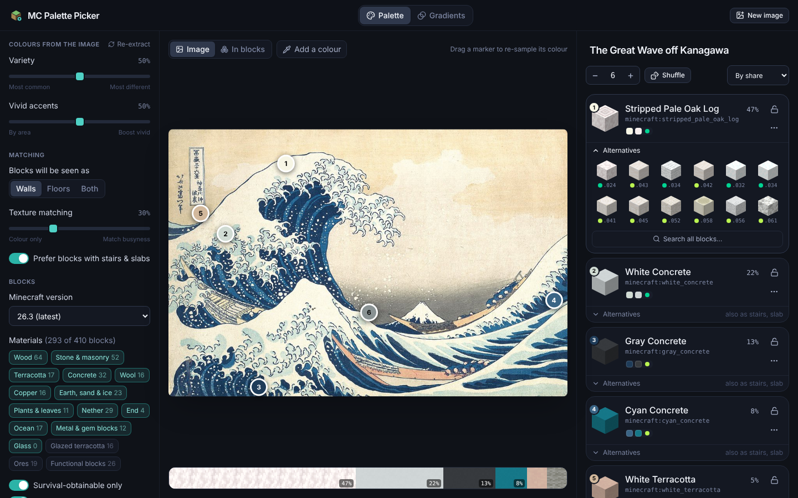
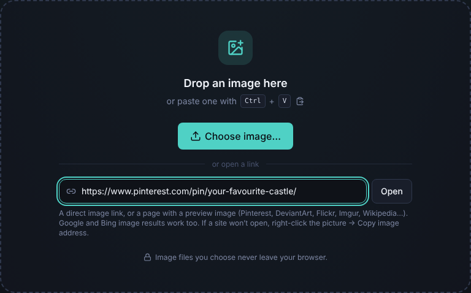
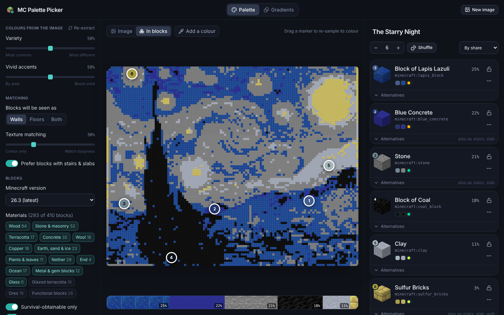
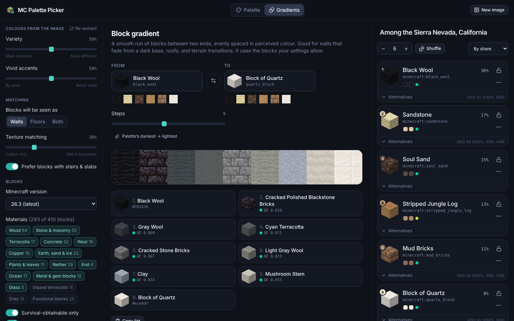
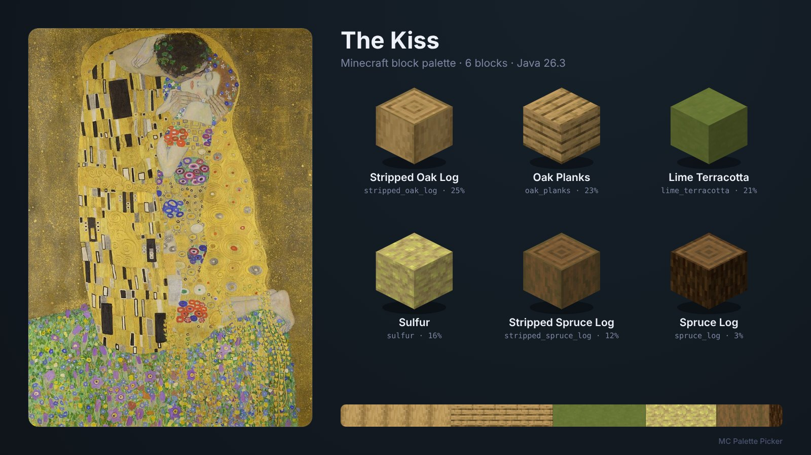

# MC Palette Picker

Drop in any image, or paste a link to one, and get a **Minecraft block palette** that matches it: concept art, a photo of a building you love, a painting or a mood board.

- **Colour extraction that sees accents.** It finds the image's main colours, plus the small vivid details (a red door, the sun in a hazy sunset) that make a palette feel like the picture.
- **Texture-true block matching.** Each block's real texture is averaged the way your eye blends it from a few blocks away. The comparison happens in a perceptual colour space, and blocks that come as stairs and slabs get a nudge.
- **Hands-on editing.** Drag markers on the image to re-sample a colour, click to add one, lock the blocks you love, shuffle the rest, and browse close alternatives.
- **Gradients.** Fade smoothly between any two blocks, for walls, roofs and terrain.
- **Files or links.** Drop, paste or pick a file, or paste a link to an image or to a page that has one (Pinterest, DeviantArt, Flickr, Imgur, Wikipedia, Google Images results…).

Image files never leave your browser. The colour work all happens there too. The only server code is a small image proxy for links (see [Opening images from links](#opening-images-from-links)). It deploys to Vercel with no configuration.



[](https://vercel.com/new/clone?repository-url=https%3A%2F%2Fgithub.com%2Fpaulprints%2FMCPalletePicker)

## Features

### Getting an image in
- **Drag and drop** anywhere on the page, **paste** with <kbd>Ctrl</kbd>/<kbd>⌘</kbd>+<kbd>V</kbd>, or **choose a file**. PNG, JPEG, WebP, GIF, AVIF, BMP and SVG work, and transparent pixels are ignored.
- **Open a link**: paste it into the link box on the start page or in **New image**, or just paste it anywhere on the page. You can also drag an image in from another browser tab. A link can be:
  - a direct image link (`https://i.imgur.com/….png`),
  - a web page with a preview image (a Pinterest pin, a DeviantArt deviation, a Flickr photo, an Imgur post, a Wikipedia article); the palette is named after the page,
  - a Google, Bing, DuckDuckGo or Yandex image-search result link, which is unwrapped to the original image,
  - a `data:image/…` link.
- Five public-domain paintings to try: Hokusai, Van Gogh, Bierstadt, Klimt and Monet.



### The palette
- 2–12 blocks. Each one shows its **share of the image**, the image colour next to the block colour with a **match grade** (ΔE), and the **stair/slab/wall/fence** variants it comes in. Badges flag blocks that **fall**, **glow**, are **see-through**, are **biome-tinted** or are **creative-only**.
- **Markers** on the image show where each colour came from. Drag one, or focus it and use the arrow keys, to re-sample that spot, and the block re-matches live.
- **Add a colour** with the eyedropper. A loupe shows the pixel colour and the block it would get.
- **Lock** a block to keep it through re-extracting and shuffling. **Shuffle** swaps unlocked blocks for other close matches. **Alternatives** shows the 12 next-best blocks, and **Search all blocks** lets you pick any block. **Never suggest** bans a block for good.
- **In blocks** rebuilds the image using only the palette, so you can judge it at a glance. A strip under the image shows each block's share.
- Sort by share, dark → light, or hue.



### Tuning
- **Variety**: the most common colours, or colours as different from each other as possible.
- **Vivid accents**: how strongly small saturated details compete with large areas.
- **Walls / Floors / Both**: match the side of each block, its top (log rings, grass), or all faces.
- **Texture matching**: smooth image areas prefer smooth blocks (concrete), busy areas prefer busy ones (cobblestone, leaves).
- **Prefer blocks with stairs & slabs.**
- **Blocks**: 16 material categories, your **Minecraft version** (1.14.4 → 26.3, so a 1.20.1 server never gets pale oak), survival-obtainable only, and whether to allow falling blocks, light sources and see-through blocks.

Settings are remembered in your browser.

### Gradients
A run of 3–16 blocks between any two blocks, evenly spaced in perceived colour, built from the blocks your settings allow. It defaults to your palette's darkest → lightest block, and any step can be added to the palette.



### Exports
| Export | What you get |
| --- | --- |
| **Palette card** (PNG, download or copy) | The image beside its blocks, drawn with real textures, with shares and a proportional strip. |
| **WorldEdit pattern** | `45%stone_bricks,33%spruce_planks,22%moss_block`, weighted by share, ready for `//set`, `//replace` or a brush. |
| **Block list** (copy or .txt) | Names, ids and shares. |
| **JSON** | Ids, names, shares, source colours and the matching stair/slab/wall ids. |
| **Share link** | The palette encoded in the URL (`#p=stone_bricks.7a7a7a.45,…`). Nothing is uploaded; the image isn't included. |
| **Save in browser** | Saved palettes appear on the start page. |



## How it works

**Block data.** `scripts/generate-data.ts` reads Mojang's block states, models, texture atlas and names from [misode/mcmeta](https://github.com/misode/mcmeta). For every block's default state it resolves the model and composites the faces that cover each whole side of the cube, including overlays like the grass block's tinted sides, with plains biome tints applied. It then measures each face:
- the **mean colour in linear light**, converted to OKLab,
- the **texture spread**: the RMS OKLab distance of its pixels from that mean (0 for concrete, around 0.1 for cobblestone),
- animated textures such as prismarine are averaged over all their frames.

The generator also classifies blocks, links stairs, slabs, walls and fences to their full block, and folds identical-looking blocks into one entry (waxed copper and infested stone). It records the first release that has each block, counting blocks that sat behind experimental data packs (cherry in 1.19.4, tuff bricks in 1.20.x) from the release that shipped them. Only these small facts are committed; textures are streamed at runtime.

**Extraction** (`src/core/extract.ts`). The image is sampled down to at most 192 px without smoothing, so no blended in-between colours are invented. The colours are binned on a 32³ sRGB grid and clustered with a seeded, weighted **k-means++** in OKLab, oversegmenting to about 3× the palette size. Bins are weighted by the square root of their pixel count so small regions keep their own clusters. The palette is then picked greedily, scoring each cluster on two things:
- **importance**: √area, plus a bonus for being more saturated than the image as a whole,
- **novelty**: distance from the colours already picked.

The *variety* slider sets the exponent on novelty, and near-duplicates are skipped. Every pixel is then assigned to its nearest palette colour to get each colour's share. Each marker goes on a representative, uniform spot, kept clear of the other markers.

**Matching** (`src/core/match.ts`). Candidates are ranked by OKLab distance, with the hue/chroma axes weighted 1.4×, because a dusty blue should become the bluest close block, not a grey that is a hair closer. Texture spread can add to the score, and a small bonus goes to blocks that have stairs and slabs. Slots choose in order of share and never share a block.

**In blocks preview** (`src/core/mosaic.ts`). The image is box-filtered to one sample per block in linear light, so a fine checkerboard becomes its true average rather than one of its colours. Each cell then takes the closest palette block in OKLab.

**Textures** (`src/render/`). The texture atlas is decoded to raw pixels in a Web Worker. Each 16×16 face is cut out, tinted and alpha-blended in TypeScript, with the same maths the data generator measures, so the textures you see are the ones the colours came from.

## Opening images from links

Browsers only let a page read an image from another website when that site allows it (CORS), and most image hosts don't. So `src/render/link.ts` tries a link three ways:

1. **Directly** from your browser. This works for image links on CORS-friendly hosts, such as the image servers of Wikimedia, Unsplash, Flickr, Pinterest, DeviantArt, Imgur, ArtStation and GitHub. No server is involved.
2. **Through the app's image proxy**, [`api/image.ts`](api/image.ts). It is a Vercel Function, and `vite dev` and `vite preview` serve it too. It downloads the link on the server and, for a web page, follows its `og:image` / `twitter:image` preview and passes on the page's title. It is deliberately narrow:
   - **Links:** http(s) only, standard ports, no credentials in the link.
   - **Addresses:** every hop (redirects, a page's preview image) must resolve to a public address. Loopback, private, link-local, cloud-metadata and other reserved IPv4/IPv6 ranges are refused. The check happens at connect time, so a DNS answer can't be switched in between.
   - **Content:** only images are returned (never SVG, which can carry scripts), at most 20 MB, within 9 seconds, with a sandboxing `Content-Security-Policy`.
3. **Through [wsrv.nl](https://wsrv.nl)**, a public open-source image proxy, if the app's proxy isn't available (for example on a static host without functions).

Image *files* you drop, paste or choose never leave your browser. A *link* is fetched by your browser, by the app's proxy or by wsrv.nl, in that order.

Some sites put their pages behind bot protection that no server can get past, among them ArtStation, Reddit and Unsplash. For those, copy the image's own address (right-click the picture → Copy image address) and paste that; their image CDNs open fine. The app's error message says so when it happens.

## Deploying

### Vercel (recommended)
1. Click **Deploy with Vercel** above, or import the repository at <https://vercel.com/new>.
2. Vercel detects Vite, and the defaults are right (`npm run build`, output `dist`). `api/image.ts` becomes the image proxy function automatically, and `vercel.json` configures the rest.
3. That's it. There are no environment variables.

`vercel.json` also proxies `/mc-assets/*` to misode/mcmeta, so the block texture atlas (~2 MB) is cached at Vercel's edge and served from your own domain.

### Anywhere else
`npm run build` produces a static site in `dist/`, and any static host works. Without the `/mc-assets` proxy the app loads textures directly from GitHub, then jsDelivr. If neither is reachable, blocks are drawn as flat colours and everything else still works. Without the `/api/image` function, links that can't be opened directly go through wsrv.nl.

## Development

```bash
npm install
npm run dev          # http://localhost:5173
npm test             # unit tests (Vitest), including the image proxy
npm run test:e2e     # browser tests (Playwright; run `npx playwright install chromium` once)
npm run check        # typecheck + lint + unit tests + production build
```

`UPDATE_SCREENSHOTS=1 npx playwright test e2e/screenshots.spec.ts --project=desktop` regenerates the images in `docs/images`.

### Project layout
```
src/core/          Pure TypeScript, no DOM: colour science, block catalogue, extraction,
                   matching, palette state, gradients, the blocks preview, links, exports
src/render/        Texture atlas (worker + compositing), block icons, palette card, image decoding, link loading
src/store/         App state (zustand) and browser storage
src/components/    React UI: landing, image stage, palette panel, gradients, settings
src/data/          Generated block data (blocks.json)
api/image.ts       The image proxy for links (Vercel Function; also served by vite dev/preview)
scripts/           Data generator and block classifier
tests/             Unit tests for the image proxy
e2e/               Playwright tests, including a local stand-in for other websites
public/samples/    Public-domain sample paintings
```

### Updating to a new Minecraft version
```bash
npm run generate:data -- --version 26.4
```
Then add the previous latest release to `VERSION_CHECKPOINTS` in `scripts/generate-data.ts` so the version filter keeps it. The unit tests check that every block got a category; new blocks without one are listed by the generator, and can be added to the rules in `scripts/classify.ts`. Behind a proxy on Node ≥ 22.21, run the generator with `NODE_USE_ENV_PROXY=1`.

## Keyboard shortcuts
| Keys | Action |
| --- | --- |
| <kbd>Ctrl</kbd>/<kbd>⌘</kbd>+<kbd>V</kbd> | Paste an image, or a link to one |
| <kbd>1</kbd> <kbd>2</kbd> | Palette / Gradients |
| Arrow keys (<kbd>Shift</kbd> for bigger steps) | Move the focused marker |
| <kbd>Esc</kbd> | Stop the eyedropper, close dialogs |

## Credits
- Block states, models, the texture atlas and names: [misode/mcmeta](https://github.com/misode/mcmeta), from Mojang's game files, loaded at runtime.
- OKLab: [Björn Ottosson](https://bottosson.github.io/posts/oklab/).
- Sample paintings (public domain, via Wikimedia Commons):
  - [*The Great Wave off Kanagawa*](https://commons.wikimedia.org/wiki/File:Tsunami_by_hokusai_19th_century.jpg), Katsushika Hokusai
  - [*The Starry Night*](https://commons.wikimedia.org/wiki/File:Van_Gogh_-_Starry_Night_-_Google_Art_Project.jpg), Vincent van Gogh
  - [*Among the Sierra Nevada, California*](https://commons.wikimedia.org/wiki/File:Albert_Bierstadt_-_Among_the_Sierra_Nevada,_California_-_Google_Art_Project.jpg), Albert Bierstadt
  - [*The Kiss*](https://commons.wikimedia.org/wiki/File:The_Kiss_-_Gustav_Klimt_-_Google_Cultural_Institute.jpg), Gustav Klimt
  - [*Impression, Sunrise*](https://commons.wikimedia.org/wiki/File:Monet_-_Impression,_Sunrise.jpg), Claude Monet

Not an official Minecraft product. Not approved by or associated with Mojang or Microsoft.

## License
[MIT](LICENSE)
